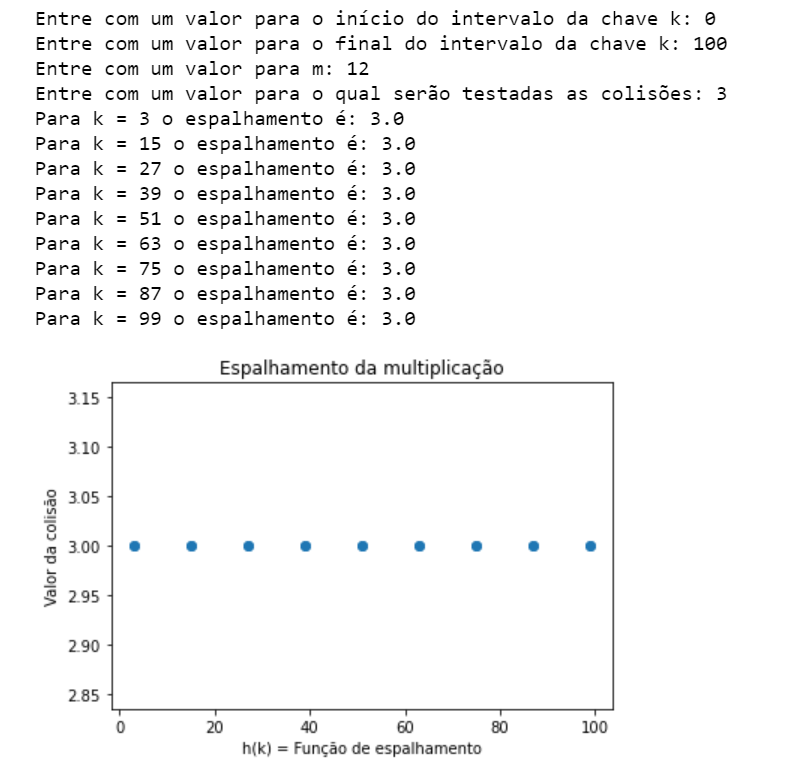
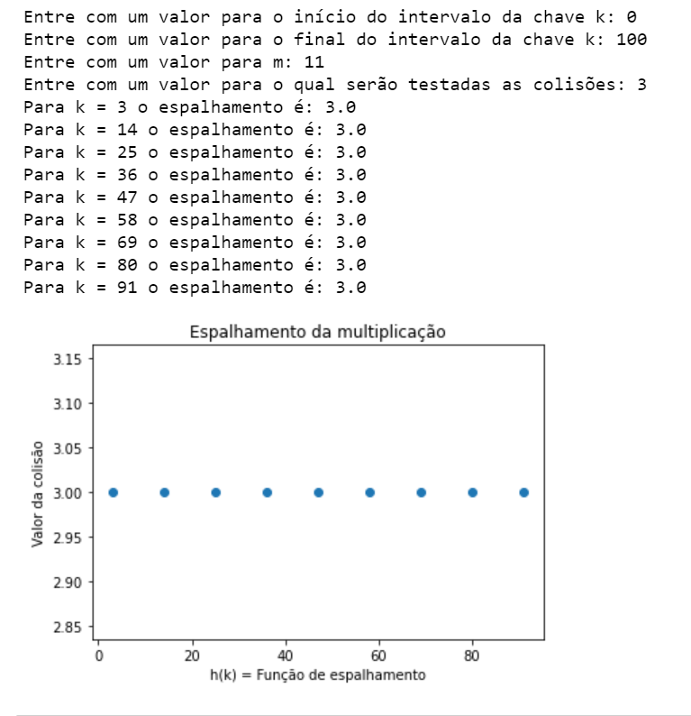
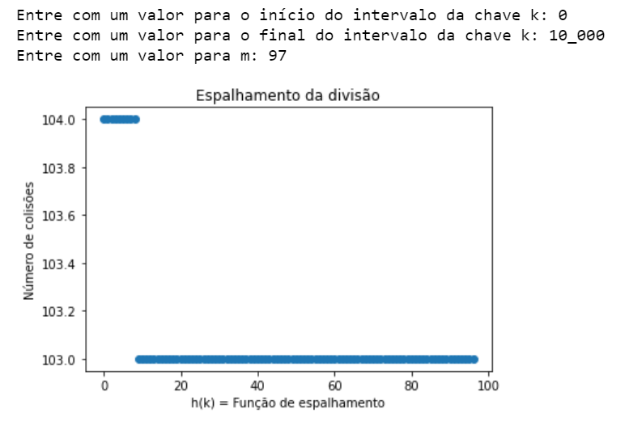
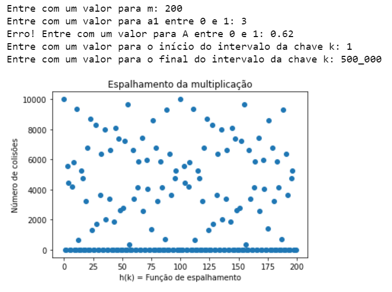
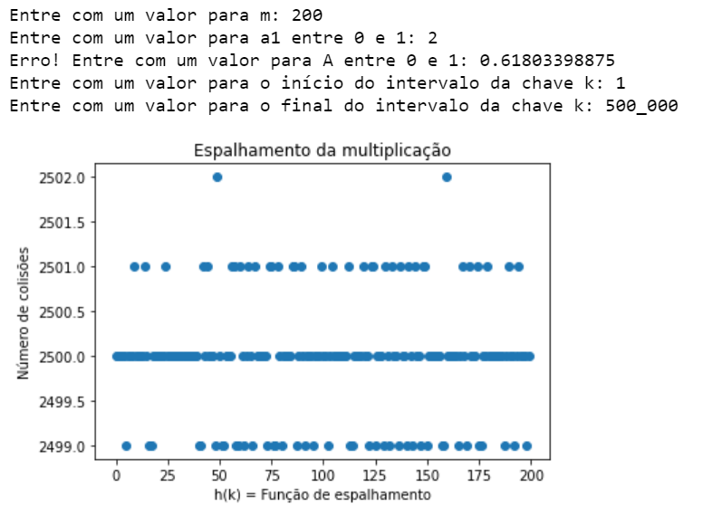

# AEDII_Espalhamento_Colisao
AEDII - Funções de Espalhamento e análise de suas colisões.

<h1>Relatório: Funções de Espalhamento e Colisões</h1>

Aluno: Ian Lacerda da Silva

RA: 11115514

Disciplina: Algoritmos e Estruturas de Dados II

Professor: Carlos da Silva dos Santos

UFABC 2021

 
 
 
 

<h3 style="color:rgb(200,100,100);">O presente projeto tem como finalidade testar o comportamento das funções de espalhamento da multiplicação e divisão utlizando algoritmos de hashing. </h3>

Serão analisadas a ocorrência de colisões e a maneira pelas quais cada respectiva função de espalhamento se comportará com a entrada de valores distintos.

Neste repositório estão presentes <b>cinco arquivos em Python</b>, <b>um notebook Jupyter</b>, um arquivo csv <b>"ex1c.csv"</b> com as saídas do <b>exercício 1 c)</b> e este arquivo <b>Leia-Me</b> com a definição do escopo do projeto. Sendo que este último é fruto de uma atividade pedida na disciplina de Algoritmos e Estruturas de Dados II, ministrada pelo professor Carlos da Silva dos Santos, da Universidade Federal do ABC (UFABC).
 
 
 
 

<h2>Questão 1</h2>
 
a) Podemos notar como padrão que os espalhamentos com valor igual a 3 no intervalo de chaves de 0 a 100 com resto da divisão com valor 12 ocorrem com chaves k ímpares e com intervalos de 12 em 12. Apresenta também 9 ocorrências de colisão.
</img>

b) Podemos notar como padrão que os espalhamentos com valor igual a 3 no intervalo de chaves de 0 a 100 com resto da divisão com valor 11 ocorrem com chaves k pares e ímpares e com intervalos de 11 em 11. Apresenta também 9 ocorrências de colisão.
</img>

c) A tabela com os respectivos valores da função espalhamento h(k) está neste repositório e a imagem abaixo descreve o comportamento da função.
</img>

<h2>Questão 2</h2>

a) Imagem da contagem de colisões da função espalhamento da multiplicação.
</img>

b) Imagem da contagem de colisões da função espalhamento da multiplicação.
</img>

<h4>a) e b) Discussão: </h4>

Vemos pelos gráficos acima que ao utlizarmos o valor 0.61803398875 para a incógnita A da função de espalhamento pela divisão, obtivemos um perfil mais concentrado do espalhamento em detrimento de A = 0.62 que apresentou um perfil mais disperso. 

Em b) vemos uma concentração na contagem do número de colisoes entre 2501 e 2500 e duas concentrações dispersas em 2502 colisões.

Podemos descartar também os valores de concentração de colisões na abscissa do item a), pois 0 não caracteriza uma colisão no gráfico.
