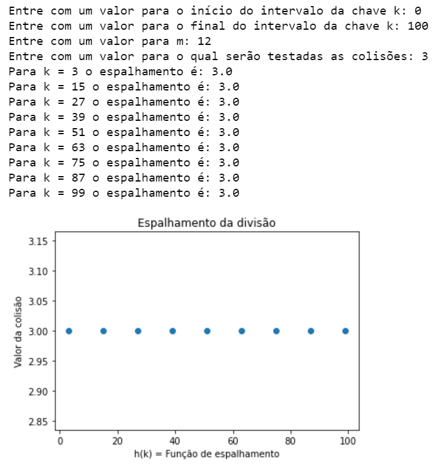

# AEDII_Espalhamento_Colisao
AEDII - Funções de Espalhamento e análise de suas colisões.

<h1>Relatório: Funções de Espalhamento e Colisões</h1>
Aluno: Ian Lacerda da Silva RA: 11115514
Disciplina: Algoritmos e Estruturas de Dados II
Professor: Carlos da Silva dos Santos
UFABC 2021

O presente projeto tem como finalidade testar o comportamento das funções de espalhamento da multiplicação e divisão utlizando algoritmos de hashing. 

Serão analisadadas a ocorrência de colisões e a maneira pelas quais cada respectiva função de espalhamento se comportará com a entrada de valores distintos.

Neste repositório estão presentes cinco arquivos em Python, um notebook Jupyter e este arquivo Leia-Me com a definição do escopo do projeto. Sendo que este último é fruto de uma atividade pedida na disciplina de Algoritmos e Estruturas de Dados II, ministrada pelo professor Carlos da Silva dos Santos, da Universidade Federal do ABC (UFABC).

1) a) Podemos notar como padrão que os espalhamentos com valor igual a 3 no intervalo de chaves de 0 a 100 com resto da divisão com valor 12 ocorrem com chaves k ímpares e com intervalos de 12 em 12. Apresenta também 9 ocorrências de colisão.
2) </img>
